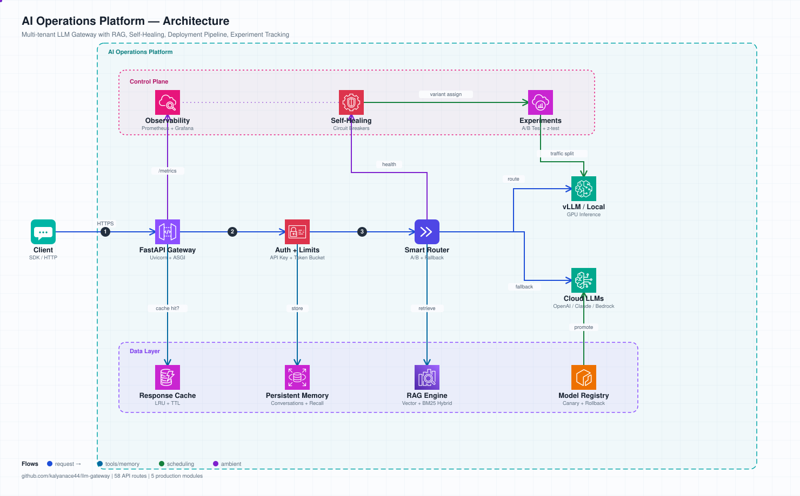

# 🚀 LLM Gateway

A production-grade LLM gateway that routes, observes, and controls multi-model inference at scale. Drop-in replacement for the OpenAI API with built-in cost tracking, A/B routing, fallback chains, rate limiting, and full observability.


## Architecture



*Animated SVG — open in browser to see request flow animation*

## Features

### Traffic Control
- **A/B Routing** — split traffic between models by weight for comparison
- **Fallback Chains** — automatic failover: if model A fails → try B → try C
- **Rate Limiting** — per-key token bucket (requests/min + tokens/min)
- **Response Cache** — exact-match deduplication with TTL and LRU eviction

### Cost & Usage
- **Per-request token counting** via tiktoken
- **Cost attribution** per API key, model, and backend
- **Budget enforcement** — keys auto-disabled when budget exceeded
- **Model cost comparison** across backends

### Observability
- **Prometheus metrics** — latency p50/p95/p99, TTFT, tokens/sec, error rates, cost
- **Grafana dashboard** — 12-panel pre-built dashboard (included)
- **Active request tracking** — real-time gauge for autoscaling
- **Backend health monitoring** — automatic unhealthy marking after 3 failures

### Security
- **API key authentication** with SHA-256 hashed storage
- **Per-key model access control** — restrict which models a key can use
- **Admin API** behind separate secret key

### Deployment
- **Docker Compose** — gateway + Redis + Prometheus + Grafana in one command
- **Helm Chart** — production K8s with HPA, health probes, config injection
- **Terraform** — AWS EKS with GPU node groups (g5.xlarge) for vLLM

## Quick Start

### 1. Install

```bash
cd llm-gateway
pip install -e .
```

### 2. Configure

```yaml
# config.yaml
backends:
  - name: my-vllm
    provider: openai
    base_url: "http://localhost:8000/v1"
    api_key: "your-key"
    models: ["meta-llama/Llama-3.1-70B-Instruct"]
    weight: 1.0
    priority: 10

  - name: openai-fallback
    provider: openai
    base_url: "https://api.openai.com/v1"
    api_key: "${OPENAI_API_KEY}"
    models: ["gpt-4o", "gpt-4o-mini"]
    weight: 0.0
    priority: 5

rate_limits:
  requests_per_minute: 120
  tokens_per_minute: 500000

default_model: "meta-llama/Llama-3.1-70B-Instruct"
fallback_chain: [my-vllm, openai-fallback]
cache_enabled: true
cache_ttl: 3600
```

### 3. Run

```bash
# Start gateway
GATEWAY_DEBUG=true python -m uvicorn gateway.main:app --port 8080

# Register an API key
curl -X POST http://localhost:8080/admin/keys \
  -H "Authorization: Bearer admin-secret" \
  -H "Content-Type: application/json" \
  -d '{"name": "my-app", "key": "sk-my-key-123"}'

# Use it (OpenAI SDK compatible)
curl http://localhost:8080/v1/chat/completions \
  -H "Authorization: Bearer sk-my-key-123" \
  -H "Content-Type: application/json" \
  -d '{"model": "meta-llama/Llama-3.1-70B-Instruct", "messages": [{"role": "user", "content": "Hello"}]}'
```

### 4. Use with OpenAI SDK

```python
from openai import OpenAI

client = OpenAI(
    base_url="http://localhost:8080/v1",
    api_key="sk-my-key-123",
)

response = client.chat.completions.create(
    model="meta-llama/Llama-3.1-70B-Instruct",
    messages=[{"role": "user", "content": "Hello"}],
)
```

## Deployment

### Docker Compose (Dev/Staging)

```bash
cd infra
docker compose up -d
```

Services: Gateway (:8080) + Redis (:6379) + Prometheus (:9090) + Grafana (:3000)

### Kubernetes (Production)

```bash
# Deploy with Helm
helm install llm-gateway infra/helm/llm-gateway \
  --set gateway.adminKey="your-admin-secret" \
  --set image.repository=your-registry/llm-gateway \
  --set image.tag=0.1.0

# Or provision infrastructure first
cd infra/terraform
terraform init && terraform apply
aws eks update-kubeconfig --name llm-gateway --region us-west-2
```

## API Reference

### Chat Completions
```
POST /v1/chat/completions    — OpenAI-compatible (streaming + non-streaming)
GET  /v1/models              — List available models
```

### Admin
```
POST   /admin/keys           — Register API key
GET    /admin/keys           — List keys
DELETE /admin/keys/{key}     — Revoke key
GET    /admin/usage          — Usage summary (last N hours)
GET    /admin/backends       — Backend health status
POST   /admin/backends/{name}/health — Trigger health check
GET    /admin/cache          — Cache statistics
POST   /admin/cache/clear    — Clear cache
```

### Observability
```
GET /health                  — Liveness/readiness probe
GET /metrics                 — Prometheus scrape endpoint
```

## Metrics Exposed

| Metric | Type | Description |
|--------|------|-------------|
| `llm_gateway_requests_total` | Counter | Total requests by method/endpoint/status |
| `llm_gateway_tokens_total` | Counter | Tokens by model/backend/direction |
| `llm_gateway_cost_usd_total` | Counter | Cost by model/backend/key |
| `llm_gateway_request_duration_seconds` | Histogram | E2E latency |
| `llm_gateway_ttft_seconds` | Histogram | Time to first token |
| `llm_gateway_tokens_per_second` | Histogram | Output throughput |
| `llm_gateway_active_requests` | Gauge | In-flight requests (HPA target) |
| `llm_gateway_backend_healthy` | Gauge | Backend health (1/0) |
| `llm_gateway_backend_errors_total` | Counter | Errors by backend/type |

## Load Test Results

```
  Concurrent:  3
  Requests:    10
  Success:     10/10 (100%)
  Cache hits:  2
  Latency p50: 12.2s (model inference dominated)
  Latency min: 0.005s (cache hit)
  Tokens/sec:  1,413
```

## Project Structure

```
llm-gateway/
├── gateway/
│   ├── main.py              # FastAPI app + lifespan
│   ├── config.py            # Settings + YAML config
│   ├── api/
│   │   ├── chat.py          # /v1/chat/completions
│   │   ├── models.py        # /v1/models
│   │   └── admin.py         # Admin endpoints
│   └── core/
│       ├── router.py        # A/B routing + fallback
│       ├── backends.py      # Backend adapters (httpx)
│       ├── auth.py          # API key management
│       ├── limiter.py       # Token bucket rate limiting
│       ├── costs.py         # Token counting + cost calc
│       ├── cache.py         # Response cache (LRU + TTL)
│       └── metrics.py       # Prometheus instrumentation
├── infra/
│   ├── docker-compose.yml   # Full observability stack
│   ├── docker/Dockerfile
│   ├── prometheus.yml
│   ├── grafana/             # Provisioning + dashboards
│   ├── helm/llm-gateway/    # K8s Helm chart
│   └── terraform/           # AWS EKS + GPU nodes
├── tests/
│   ├── test_core.py         # 18 unit tests
│   └── load_test.py         # Async load test script
├── config.yaml              # Local dev config
└── pyproject.toml
```

## Tech Stack

- **Runtime**: Python 3.11 + FastAPI + uvicorn
- **HTTP**: httpx (async, connection pooling)
- **Metrics**: prometheus-client
- **Tokens**: tiktoken
- **Streaming**: SSE via sse-starlette
- **Infra**: Docker, Helm, Terraform (AWS EKS)
- **Observability**: Prometheus + Grafana

## License

MIT
